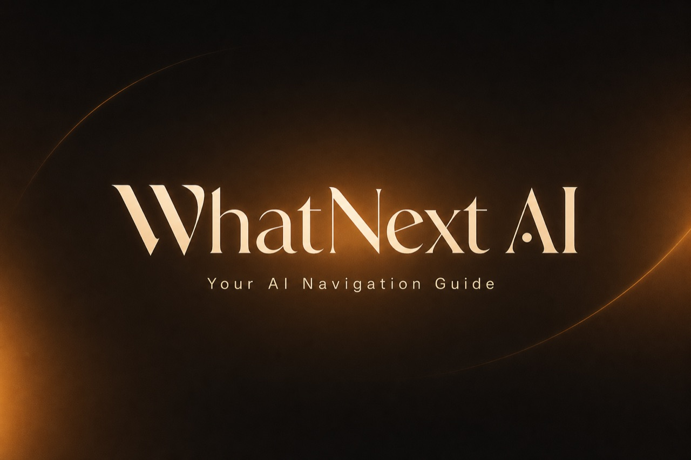

<p align="center">
  
</p>

<p align="center">
  <strong>Your AI Navigation Guide</strong><br />
  Clear, actionable paths when you feel stuck — Safe, Bold, and Balanced.
</p>

<p align="center">
  <a href="#features">Features</a> ·
  <a href="#how-it-works">How it works</a> ·
  <a href="#tech-stack">Tech stack</a> ·
  <a href="#getting-started">Getting started</a>
</p>

---

## Overview

**WhatNext AI** helps people who feel stuck explore clear next steps. Describe a situation in plain language — career change, starting something new, money decisions, or anything in between — and the app maps **three distinct paths forward**:

| Path | Intent |
|------|--------|
| **Safe** | Lower risk, steadier progress |
| **Bold** | Higher ambition, more stretch |
| **Balanced** | A practical middle ground |

Each path includes numbered steps, estimated timelines, and the tools you need. Follow along, track progress, and ask follow-up questions with your personal **Navigator**.

> *Stuck? Tell us what's going on — we'll show you what to do next.*

---

## Features

- **Three paths per analysis** — Choose direction based on your risk tolerance, not a single generic answer
- **Plain-language guidance** — Messy life problems turned into clear, actionable steps
- **Step tracking & history** — Save sessions, mark progress, and pick up where you left off
- **Personal Navigator chat** — Ask follow-ups as you move through a path
- **Auth & guest mode** — Try without an account; sign in to keep history across devices
- **Usage-aware backend** — Quotas and sessions powered by Supabase

---

## How it works

1. **Describe your situation** — Everyday language is enough; no formal framework required  
2. **Get three paths** — Easy / Medium / Advanced routes with steps, timelines, and tools  
3. **Follow, track & ask** — Mark steps done, chat with Navigator, revisit anytime  

---

## Tech stack

| Layer | Stack |
|-------|--------|
| Frontend | React 19, Vite, TypeScript, Tailwind CSS, Framer Motion, Zustand |
| Backend | Express (TypeScript), Gemini and/or Anthropic |
| Auth & data | Supabase |
| Observability | Sentry (optional) |

```
whatnext-ai/
├── src/          # React UI, routing, client services
├── server/       # Express API + AI providers
├── public/       # Static assets
└── docs/         # README media
```

---

## Getting started

### Prerequisites

- [Node.js](https://nodejs.org/) (current LTS recommended)
- API key for at least one AI provider (Gemini or Anthropic)
- Supabase project (for auth and sessions)

### 1. Clone & install

```bash
git clone https://github.com/<YOUR_USERNAME>/<YOUR_REPO>.git
cd whatnext-ai
npm install
cd server && npm install && cd ..
```

### 2. Environment

**Frontend** — copy [`.env.example`](.env.example) to `.env`:

```bash
cp .env.example .env
```

| Variable | Purpose |
|----------|---------|
| `VITE_API_URL` | Express API URL (default `http://localhost:3001`) |
| `VITE_SUPABASE_URL` | Supabase project URL |
| `VITE_SUPABASE_ANON_KEY` | Supabase anon/public key |
| `VITE_SENTRY_DSN` | Optional frontend error tracking |

**API** — copy [`server/.env.example`](server/.env.example) to `server/.env` and set at least one provider key (`GEMINI_API_KEY` / `GOOGLE_API_KEY` and/or `ANTHROPIC_API_KEY`). See that file for `AI_PROVIDER` and model options. Optional: `SENTRY_DSN` for backend errors.

### 3. Run locally

```bash
npm run dev:all
```

| App | URL |
|-----|-----|
| Frontend | http://localhost:5173 |
| API | http://localhost:3001 |

Or run separately: `npm run dev` (frontend) and `npm run dev:server` (API).

---

## Scripts

| Command | Description |
|---------|-------------|
| `npm run dev` | Vite dev server |
| `npm run dev:server` | Express API |
| `npm run dev:all` | Frontend + API together |
| `npm run build` | Typecheck + production build |
| `npm run preview` | Preview production build |
| `npm run lint` | TypeScript check (`tsc --noEmit`) |

---

## Screenshots

<!-- Drop product screenshots into docs/ and uncomment:

<p align="center">
  
  
</p>
<p align="center">
  
  
</p>

Suggested shots: landing hero, three paths result, Navigator chat, path progress / history.
-->

*Product screenshots coming soon — add PNGs under `docs/` and uncomment the block above.*

---

## Contributing

Issues and pull requests are welcome. For larger changes, open an issue first so we can align on direction.

---

## License

Private / unlicensed unless otherwise stated. Contact the maintainer before redistributing.

---

<p align="center">
  Built with care · WhatNext AI
</p>
